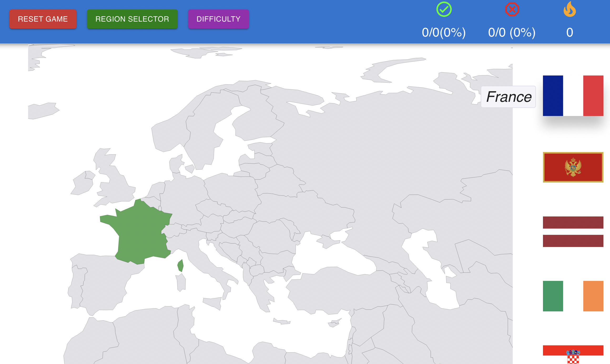
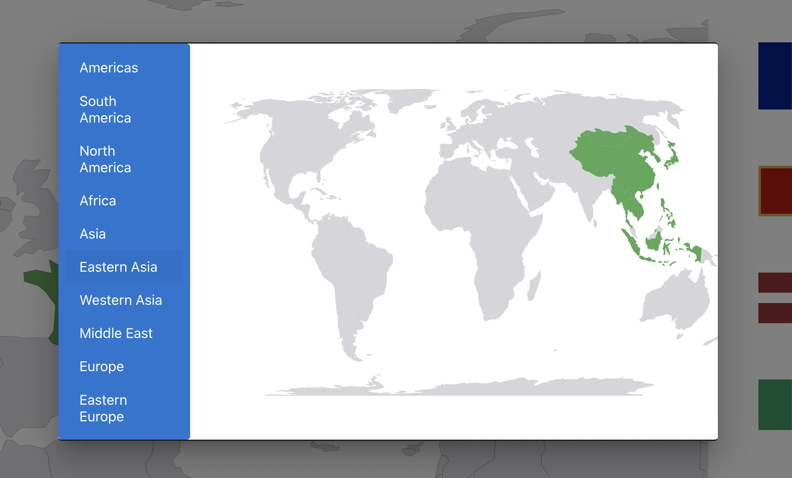

## Geography Game

An educational game in React which displays an interactive map of the world to the user. The user is prompted to select a region of the world to be quizzed on the geography of that region, which involves identifying the correct country which has been highlighted. Utilizes a system of scoring and “streaks” of correct answers in order to gamify an educational experience. 

## Features
- Ability to select which reason of the world the user would like to be quizzed on.

Note: Although many are present, which countries constitute a given region is often a matter of opinion. Best attempts to represent regions correctly are given here.

- Score keeping and "streaks" of number/percentage of correct and incorrect answers.
- Ability to zoom in and out of the map courtesy of react-simple-maps.

## Project Screen Shot(s)

#### Main Page:   

#### Region Selector Map:  

## Installation and Setup Instructions

#### Example:  

Clone down this repository. You will need `node` and `npm` installed globally on your machine.  

Installation will require running

`npm install` 